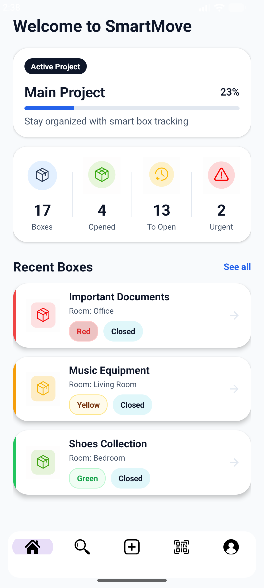
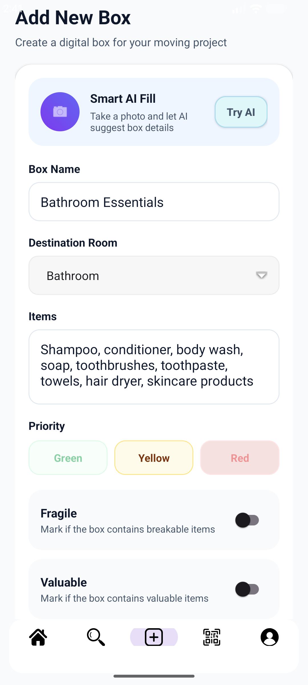
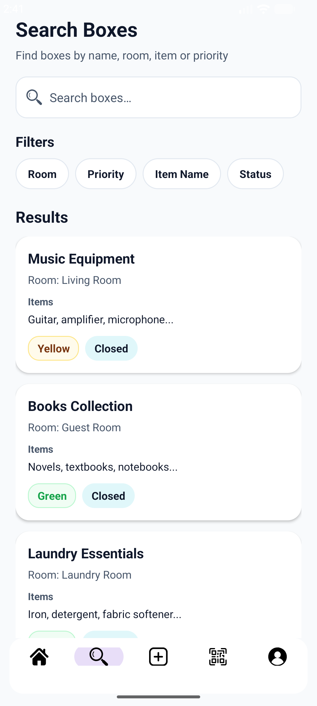
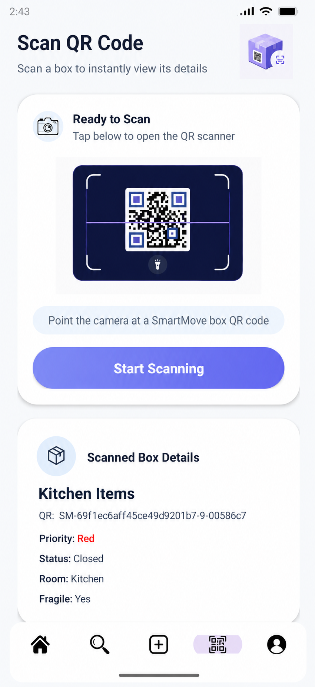

# SmartMove 📦

> An AI-powered Android application for managing home relocation using QR codes, image recognition, and smart box organization.

---

## Overview

SmartMove is an AI-powered Android application designed to simplify and organize the home relocation process.

The application enables users to create moving projects, organize rooms and moving boxes, generate and scan QR codes, search for boxes and items, manage unpacking progress, and receive AI-assisted suggestions based on images of box contents.

The AI-generated suggestions are presented to the user for review before being applied, allowing the user to accept or modify the suggested information.

SmartMove follows a client-server architecture built with Kotlin, FastAPI, MongoDB, and YOLOWorld.

---

## Core Features

- User authentication (Register / Login)
- Moving project management
- Room management
- Box creation and editing
- QR code generation and scanning
- Search and filtering
- Box status management
- Priority-based opening list
- AI-assisted image analysis
- Secure REST API communication

---

## Screenshots

### Main Screens

| Home | Add Box | Search |
|------|----------|--------|
|  |  |  |

| Box Details | Edit Box | QR |
|-------------|----------|----------|
|  |  |  |

---

## Highlights

- AI-powered box recognition
- Automatic QR code generation
- Fast QR code scanning
- Smart item and room search
- Priority-based unpacking workflow
- Secure JWT authentication
- FastAPI REST backend
- MongoDB database
- Fragment-based Android application

---

## Tech Stack

| Layer | Technologies |
|--------|--------------|
| Mobile | Kotlin, Android Studio, Retrofit |
| Backend | FastAPI, Python |
| Database | MongoDB |
| Authentication | JWT |
| AI | YOLOWorld |

---

## Architecture

| Component | Pattern |
|----------|---------|
| Mobile App | Fragment-based Android application |
| Data Layer | Retrofit networking layer |
| Communication | REST API |
| Authentication | JWT |
| Database | MongoDB |

---

## Planned vs. Implemented

The final version successfully implements the core functionality defined for the project.

Some planned features were intentionally left for future development.

The following planned capabilities were **not implemented** in the final version:

- Guest mode (using the application without registration).
- Multi-user collaboration on the same moving project.

These features were identified as future improvements and were outside the scope of the final submission.

---

## Testing

The application was manually tested to verify the complete system workflow and the integration between all components.

Testing was performed manually on both an Android emulator and a physical Android device. The backend API was also verified independently to ensure proper communication between the mobile application and the server.

The following functionality was successfully verified:

- User registration and login
- JWT authentication
- Project creation and management
- Room management
- Box creation and editing
- QR code generation
- QR code scanning
- Search and filtering
- Priority opening list
- Box status updates
- AI image upload
- AI analysis and suggestion approval
- Backend integration
- Error handling (invalid login, invalid QR code, unauthorized access)

All core functionalities were successfully verified on both the Android application and the FastAPI backend.

Performance testing, load testing, and multi-user concurrent usage were outside the scope of this project.

---

## Backend Repository

➡️ [**SmartMove Server**](https://github.com/nikolpinchevsky/SmartMove-server)

---

## Authors

- Nikol Pinchevsky
- May Shabat

---

## License

This project was developed as the final Computer Science project at Afeka – Academic College of Engineering in Tel Aviv.